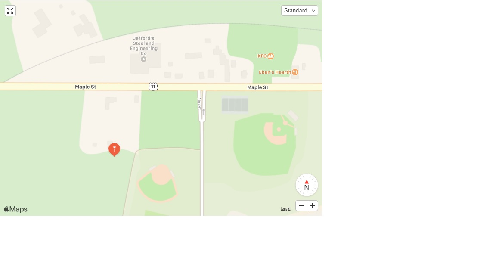
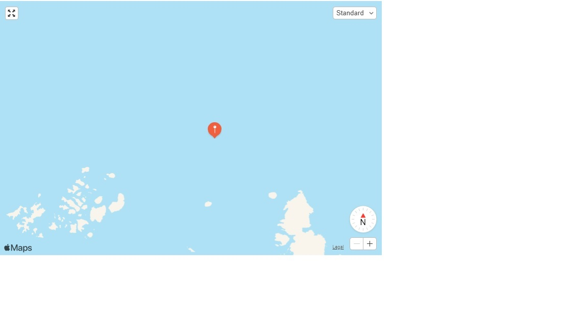
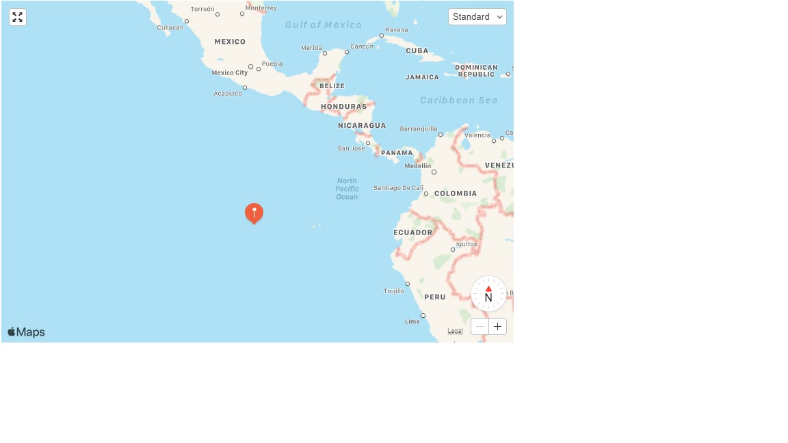
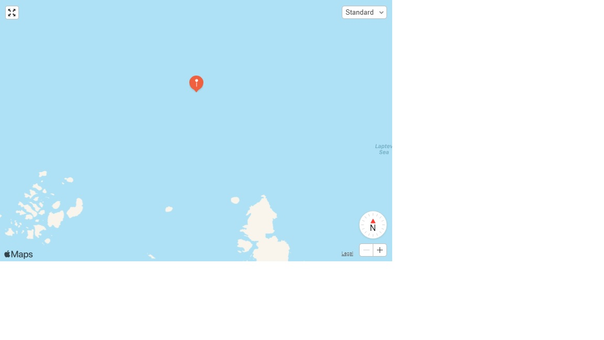

# Elwakdy-TripData
 

# Time range of datetime 

<br>

# Question 1:

<br>

# Smallest_date_pickup_datetime =  2013-01-01 00:00:00

# Largest_date_pickup_datetime =  2013-01-31 23:59:59

# Smallest_date_dropoff_datetime =  2013-01-01 00:00:36

# Largest_date_dropoff_datetime =  2013-02-01 10:33:08

<br>

```

        pickup_datetime=line[5]

        ######
        
        fdt = None
        
        try:

            fdt = datetime.datetime.strptime(pickup_datetime, "%Y-%m-%d %H:%M:%S")
            puc += 1

        except ValueError as e:
            
            print('could not convert'+ str(e))
            
        #######

        dropoff_datetime =line[6]

        #######
        
        fdt1 = None
        try:

            fdt1 = datetime.datetime.strptime(dropoff_datetime, "%Y-%m-%d %H:%M:%S")
            doc+=1

        except ValueError as e:
            
            print('could not convert'+ str(e))

        ########

        # The smallest and lasrgest date of pickup_datetime
        # Compare all dates with the first date in the list "01/01/13  03:11:48"

        if puc == 1:
            Smallest_date_pickup_datetime = fdt
            Largest_date_pickup_datetime = fdt
            
        if doc == 1:
            Smallest_date_dropoff_datetime = fdt1
            Largest_date_dropoff_datetime = fdt1
        
        if fdt is not None: 
            if Smallest_date_pickup_datetime > fdt:
                Smallest_date_pickup_datetime = fdt

            if Largest_date_pickup_datetime < fdt:
                Largest_date_pickup_datetime = fdt

        if fdt1 is not None:  
            if Smallest_date_dropoff_datetime > fdt1:
                Smallest_date_dropoff_datetime = fdt1
                
            if Largest_date_dropoff_datetime < fdt1:
                Largest_date_dropoff_datetime = fdt1

```

<br>

# Number of rows= 14776615

```

for line in reader:
        
        i+=1

print ('Number of rows= ' + str(i))

```

<br>

# Question: 2

<br>

medallion, hack_license, vendor_id, rate_code, store_and_fwd_flag, pickup_datetime, dropoff_datetime, passenger_count, trip_time_in_secs, 
trip_distance, pickup_longitude, pickup_latitude, dropoff_longitude, dropoff_latitude.


|    Field Name  | Description |
| ------------- | --------------------- |
|   Medallion   |A transferable permit in the United States allowing a taxicab driver to operate|
| Hack License | Hack license is known as a New York City Taxi Operators License. The license allows the holder / driver to operate a Yellow Medallion Taxicab in the Five Boroughs of the City of New York|
|   Vendor Id  | The Vendor ID is a ten-digit identifier issued by New York State when the vendor is registered on the Statewide Vendor File|
| Rate Code |The final rate code in effect at the end of the trip|
| Store and Fwd Flag  | Store and fwd flag indicates whether the trip record was held in vehicle memory before sending to the vendor |
| Pickup Datetime |The date and time to pick up the passenger |
|   Dropoff Datetime |The date and time to drop off the passenger |
| Passenger Count |The number of passengers in the vehicle|
|  Trip Time in Secs  |The trip time per seconds  |
| Trip Distance |The trip distance is the difference between the pickup time and drop off time of the passenger(s)|
|   Pickup Longitude  |The longitude of the point where the taximeter was engaged|
|  Pickup Latitude |The latitude of the point where the taximeter was engaged|
|   Dropoff Longitude  |The longitude of the point where the taximeter was disengaged|
| Dropoff Latitude |The latitude of the point where the taximeter was disengaged|

```
with open('C:/Users/elwakdmf/Desktop/trip_data_1.csv', 'r') as f:
    d_reader = csv.DictReader(f)
    headers = d_reader.fieldnames
```

<br>

# Question 3

<br>

# Some sample data for each field

# Sample 1

|    Sample Data  | Description |
| ------------- | --------------------- |
| Medallion | DFD2202EE08F7A8DC9A57B02ACB81FE2|
|Hack License |51EE87E3205C985EF8431D850C786310|
|Vendor Id |CMT|
|Rate Code |1|
|Store and Fwd Flag |N|
|Pickup Datetime |2013-01-07 23:25:03|
|Dropoff Datetime | 2013-01-07 23:34:24|
|Passenger Count |1|
|Trip Time in Secs| 560|
|Trip Distance |2.10|
|Pickup Longitude| -73.97625|
|Pickup Latitude  |40.748528|
|Dropoff Longitude |-74.002586|
|Dropoff Latitude |40.747868|

<br>
# Sample 2

|    Sample Data  | Description |
| ------------- | --------------------- |
|Medallion | 2D4B95E2FA7B2E85118EC5CA4570FA58|
|Hack License |CD2F522EEE1FF5F5A8D8B679E23576B3|
|Vendor Id |CMT|
|Rate Code |1|
|Store and Fwd Flag |N|
|Pickup Datetime |2013-01-07 15:33:28|
|Dropoff Datetime | 2013-01-07 15:49:26|
|Passenger Count |2|
|Trip Time in Secs| 957|
|Trip Distance |2.50|
|Pickup Longitude| -73.977936|
|Pickup Latitude  |40.786983|
|Dropoff Longitude |-73.952919|
|Dropoff Latitude |40.80637|

<br>
# Sample 3

|    Sample Data  | Description |
| ------------- | --------------------- |
|Medallion | 3349F919AA8AE5DC9C50A3773EA45BD8|
|Hack License |7CE849FEF67514F080AF80D990F7EF7F|
|Vendor Id |CMT|
|Rate Code |1|
|Store and Fwd Flag |N|
|Pickup Datetime |2013-01-10 15:42:29|
|Dropoff Datetime |2013-01-10 16:04:02|
|Passenger Count |1|
|Trip Time in Secs|1293|
|Trip Distance |3.20|
|Pickup Longitude|-73.994911|
|Pickup Latitude  |40.723221|
|Dropoff Longitude |-73.971558|
|Dropoff Latitude |40.761612|

<br>

# Question 4

<br>

# The geographic range of my data (min/max - X/Y)


|    File Name  | Data Type |
| ------------- | --------------------- |
|Medallion | varchar(32)|
|Hack License |varchar(32)|
|Vendor Id |text|
|Rate Code |int(3)|
|Store and Fwd Flag |varchar(1)|
|Pickup Datetime |datetime|
|Dropoff Datetime |datetime|
|Passenger Count |int(3)|
|Trip Time in Secs|int(18)|
|Trip Distance |decimal (5.3)|
|Pickup Longitude|decimal (9.7)|
|Pickup Latitude  |decimal (9.7)|
|Dropoff Longitude |decimal (9.7)|
|Dropoff Latitude |decimal (9.7)|

<br>

# Question 5

<br> 

|  Longitude/Latitude   | Geographic range of my data (min/max - X/Y) |
| ------------- | --------------------- |
| Max Pickup Longitude/Pickup  | -98.866356|
| Min Pickup Longitude/Pickup| 80.842125 |
|  Max Pickup Latitude/Pickup   | 82.514046|
| Min Pickup latitude/Pickup| -39.762348 |
|  Max Droppoff Longitude/Droppoff    |-98.75|
| Min Droppoff Longitude/Droppoff | 84.315735 |
|  Max Droppoff Latitude/Droppoff   | 83.516693|
| Min Droppoff latitude/Droppoff| -0.56333297 |

<br>

# Plot Max Pickup Longitude/Pickup against Min latitude/Pickup on a map



# Plot Min Pickup Longitude/Pickup against Max latitude/Pickup on a map 



# Plot Max Dropoff Longitude/Pickup against Min latitude/Droppoff on a map 



# Plot Min Dropoff Longitude/Pickup against Max latitude/Droppoff on a map 



<br>

```
                min_pickup_longitude = line[10]
                min_pickup_longitude = min_pickup_longitude                                                                                                                                   
                max_pickup_longitude = line[10]
                max_pickup_longitude = max_pickup_longitude 

                min_pickup_latitude = line[11]
                min_pickup_latitude = min_pickup_latitude 
                max_pickup_latitude = line[11]
                max_pickup_latitude =max_pickup_latitude 

                min_dropoff_longitude = line[12]
                min_dropoff_longitude = min_dropoff_longitude 
                max_dropoff_longitude = line[12]
                max_dropoff_longitude = max_dropoff_longitude 

                min_dropoff_latitude = line[13]
                min_dropoff_latitude = min_dropoff_latitude
                max_dropoff_latitude = line[13]
                max_dropoff_latitude = max_dropoff_latitude 
                

                if line[10] != "" and float(line[10]) < 100 and float(line[10])>-99:

                        if float(line[10]) < float(max_pickup_longitude):
                            max_pickup_longitude = line[10]
                        if float(line[10]) > float(min_pickup_longitude):
                            min_pickup_longitude = line[10]

                 if line[11] != "" and float(line[11]) < 100 and float(line[11])>-99:

                        if float(line[11]) > float(max_pickup_latitude):
                            max_pickup_latitude = line[11]
                        if float(line[11]) < float(min_pickup_latitude):
                            min_pickup_latitude = line[11]

                 if line[12] != "" and float(line[12]) < 100 and float(line[12])>-99:

                        if float(line[12]) < float(max_dropoff_longitude):
                            max_dropoff_longitude = line[12]
                        if float(line[12]) > float(min_dropoff_longitude):
                            min_dropoff_longitude = line[12]

                 if line[13] != "" and float(line[13]) < 100 and float(line[13])>-99:

                        if float(line[13]) > float(max_dropoff_latitude):
                            max_dropoff_latitude = line[13]
                        if float(line[13]) < float(min_dropoff_latitude):
                            min_dropoff_latitude = line[13]


```
<br>

# Question 6

<br>

# In this code, the distinct values of some fields suchas pickup_datetime, dropoff_datetime, medallion, hack_license, rate_code, passenger_count, trip_time_in_secs and trip_distance are getting on. 

# I used a dictionary to get the total number of values for each field. Please run the python code to get the distinct values of other fields. 

# For an example of distint values of some fields explained below: 

<br>

|   Field Name   | Distinct Values |
| ------------- | --------------------- |
|   Rate Code   | MAX: 14456067, MIN:  1|
| passenger_count | MAX:  10471701, MIN: |

<br>


```
pickup_datetime = line[5].replace('-',':')
        pickup_datetime = pickup_datetime.replace(' ',':')

        pickup_datetime = pickup_datetime[0:4] + ':' + pickup_datetime[5:7] + ':' + pickup_datetime[8:10] + pickup_datetime[10:13]+ pickup_datetime[13:16]
        
        if pickup_datetime in mhist.keys():
            
            mhist[pickup_datetime] += 1  
             
        else:
            
            mhist[pickup_datetime] = 1

        if 'pick:p_:atetime' in mhist:

            del mhist['pick:p_:atetime']

        ###   

        dropoff_datetime = line[6].replace('-',':')
        dropoff_datetime = dropoff_datetime.replace(' ',':')

        dropoff_datetime = dropoff_datetime[0:4] + ':' + dropoff_datetime[5:7] + ':' + dropoff_datetime[8:10] + dropoff_datetime[10:13]+ dropoff_datetime[13:16]
        
        if dropoff_datetime in mhist1.keys():
            mhist1[dropoff_datetime] += 1

        else:
            mhist1[dropoff_datetime] = 1
            
        if 'drop:ff:datetime' in mhist1:

            del mhist1['drop:ff:datetime']

        ###
            
        medallion= line [0]    

        if medallion in mhist2.keys():
            mhist2[medallion] += 1
        else:
            mhist2[medallion] = 1

        if 'medallion' in mhist2:

            del mhist2['medallion']

        ###

        hack_license= line [1]    

        if hack_license in mhist3.keys():
            mhist3[hack_license] += 1
        else:
            mhist3[hack_license] = 1

        if 'hack_license' in mhist3:
            del mhist3['hack_license']

        ###

        rate_code = line [3]    

        if rate_code in mhist4.keys():
             mhist4[rate_code] += 1
        else:
             mhist4[rate_code] = 1

        if 'rate_code' in mhist4:
             del mhist4['rate_code']

        ###

        passenger_count = line [7]    

        if passenger_count in mhist5.keys():
             mhist5[passenger_count] += 1
        else:
             mhist5[passenger_count] = 1

        if 'passenger_count' in mhist5:
             del mhist5['passenger_count']

        ###

        trip_time_in_secs = line [8]    

        if trip_time_in_secs in mhist6.keys():
             mhist6[trip_time_in_secs] += 1
        else:
             mhist6[trip_time_in_secs] = 1

        if 'trip_time_in_secs' in mhist6:
             del mhist6['trip_time_in_secs']

        ###

        trip_distance = line [9]
        #trip_distance = trip_distance[0:4]

        if trip_distance in mhist7.keys():
             mhist7[trip_distance] += 1
        else:
             mhist7[trip_distance] = 1

        if 'trip_distance' in mhist7:
             del mhist7['trip_distance']


```

<br>

# Question 7

<br>

|   Field Name   | Max/Min Values |
| ------------- | --------------------- |
| trip_time_in_secs| MAX  10800, Min 0|
|  trip_distance   |MAX 99.90, Min 0|
|  Rate Code   |MAX 9 , Min 0|


```

                min_rate_code = line[3]
                max_rate_code = line[3]

                min_rate_code = line[8]
                max_rate_code = line[8]

                min_trip_distance   = line[9]
                max_trip_distance   = line[9]


                if line[3] > max_rate_code:
                        max_rate_code = line[3]
                if line[3] < min_rate_code:
                        min_rate_code = line[3]

                if int(line[8]) > int(max_trip_time_in_secs):
                        max_trip_time_in_secs  = line[8]
                if int(line[8]) < int(min_trip_time_in_secs):
                        min_trip_time_in_secs  = line[8]

                if line[9] > max_trip_distance :
                        max_trip_distance = line[9]
                if line[9] < min_trip_distance :
                        min_trip_distance = line[9]


```

<br>

# Question 8

<br>

# Pickup Ddatetime
# The average number of passengers each hour of the day 

|   Hour   | Avarage  |
| ------------- | --------------------- |
| 15| 1.7161581455566817|
| 00| 1.7674645758797922|
| 18| 1.7012934622800804|
| 23| 1.7540406583168833|
| 11| 1.6736848030241087|
| 12| 1.6811567347356455|
| 13| 1.688445186465027|
| 09| 1.6280298565816753|
| 07| 1.5957135230796233|
|14|1.695371301700947|
|22|1.7441527481804624|
|17|1.7042513525845773|
|06|1.5543789390756302|
|21|1.723739471842693|
|08|1.6261664483250076|
|19|1.7074959246849928|
|03|1.7749906599564864|
|04|1.7498726500909643|
|20|1.7098300345053143|
|01|1.7650990993235585|
|10|1.7715300962533436|
|02|1.7715300962533436|
|16|1.7186234442907942|
|05|1.620607966457023|

<br>

```
if Hour_datetime in d.keys():
                d[Hour_datetime] += 1
        else:
                d[Hour_datetime] = 1

        if Hour_datetime in mhist12.keys():

                mhist12[Hour_datetime] += int(line[7])
        else:
                mhist12[Hour_datetime] = int(line[7])


        # Get one out of every thousand rows (pickup_datetime)


```


