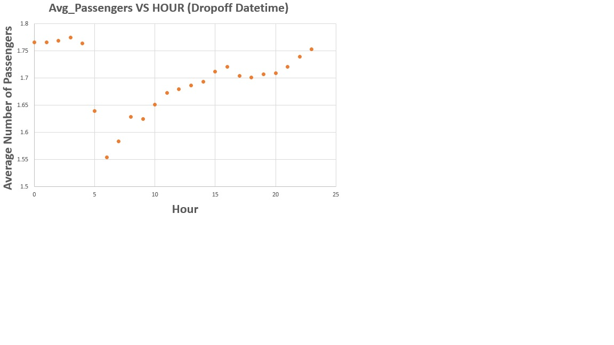
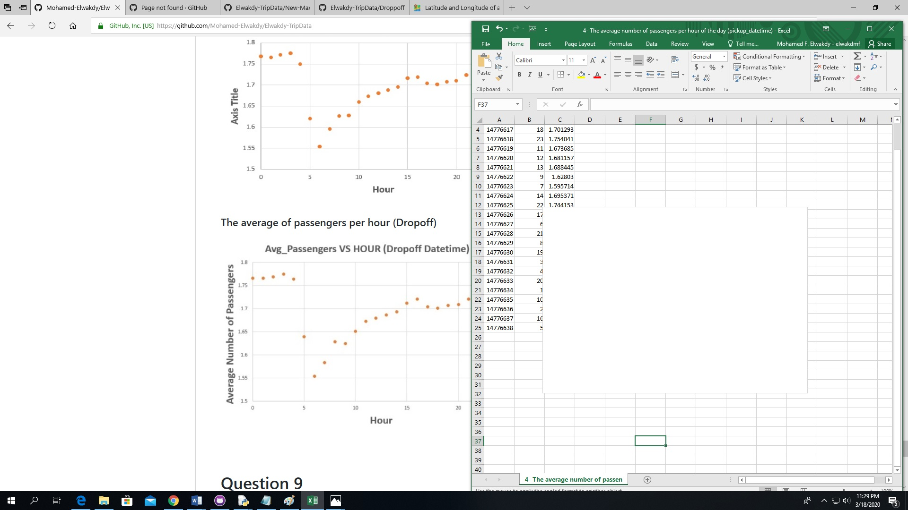
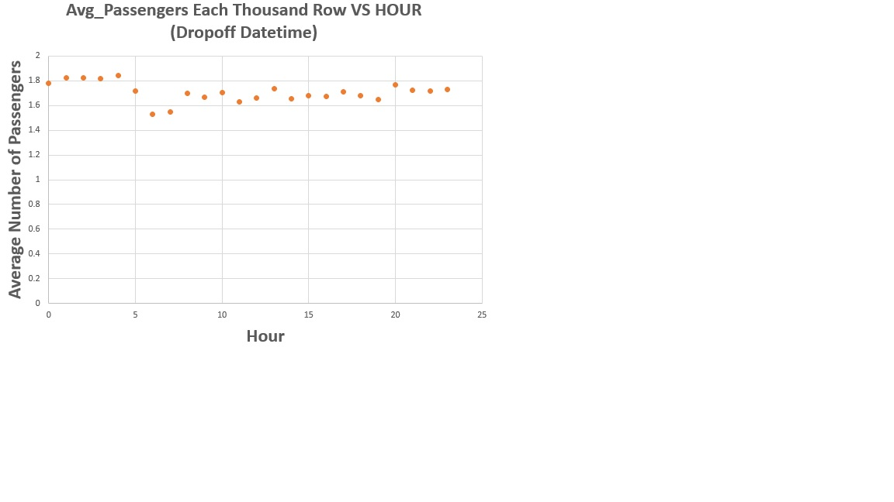

# Elwakdy-TripData
 

<br>

# Question 1:

<br>

### Time range of datetime 

### Smallest_date_pickup_datetime =  2013-01-01 00:00:00

### Largest_date_pickup_datetime =  2013-01-31 23:59:59

### Smallest_date_dropoff_datetime =  2013-01-01 00:00:36

### Largest_date_dropoff_datetime =  2013-02-01 10:33:08

<br>

### Here, I will chech all the datatime out before I start work on datatime in "Packup Datetime" and "Dropoff Datetime". 
### This means that I match format below of %Y_%m_%d %H:%M:%S and see if there is any invalid datetime. 

```

        pickup_datetime=line[5]

        ######
        
        fdt = None
        
        try:

            fdt = datetime.datetime.strptime(pickup_datetime, "%Y-%m-%d %H:%M:%S")
            puc += 1

        except ValueError as e:
            
            print('could not convert'+ str(e))
            
        #######

        dropoff_datetime =line[6]

        #######
        
        fdt1 = None
        try:

            fdt1 = datetime.datetime.strptime(dropoff_datetime, "%Y-%m-%d %H:%M:%S")
            doc+=1

        except ValueError as e:
            
            print('could not convert'+ str(e))

        ########

        # The smallest and largest date of pickup_datetime

        if puc == 1:
            Smallest_date_pickup_datetime = fdt
            Largest_date_pickup_datetime = fdt
            
        if doc == 1:
            Smallest_date_dropoff_datetime = fdt1
            Largest_date_dropoff_datetime = fdt1
        
        if fdt is not None: 
            if Smallest_date_pickup_datetime > fdt:
                Smallest_date_pickup_datetime = fdt

            if Largest_date_pickup_datetime < fdt:
                Largest_date_pickup_datetime = fdt

        if fdt1 is not None:  
            if Smallest_date_dropoff_datetime > fdt1:
                Smallest_date_dropoff_datetime = fdt1
                
            if Largest_date_dropoff_datetime < fdt1:
                Largest_date_dropoff_datetime = fdt1

```

<br>

### Number of rows= 14776615

```

for line in reader:
        
        i+=1

print ('Number of rows= ' + str(i))

```

<br>

# Question: 2

<br>

### The field names are: 

### medallion, hack_license, vendor_id, rate_code, store_and_fwd_flag, pickup_datetime, dropoff_datetime, passenger_count, trip_time_in_secs, trip_distance, pickup_longitude, pickup_latitude, dropoff_longitude, dropoff_latitude.


|    Field Name  | Description |
| ------------- | --------------------- |
|   medallion   |A transferable permit in the United States allowing a taxicab driver to operate|
| hack_license | Hack license is known as a New York City Taxi Operators License. The license allows the holder / driver to operate a Yellow Medallion Taxicab in the Five Boroughs of the City of New York|
|   vendor_id  | The Vendor ID is a ten-digit identifier issued by New York State when the vendor is registered on the Statewide Vendor File|
| rate_code |The final rate code in effect at the end of the trip|
| store_and_fwd_flag  | Store and fwd flag indicates whether the trip record was held in vehicle memory before sending to the vendor |
| pickup_datetime |The date and time to pick up the passenger |
|   dropoff_datetime |The date and time to drop off the passenger |
| passenger_count |The number of passengers in the vehicle|
|  trip_time_in_secs  |The trip time per seconds  |
| trip_distance |The trip distance is the difference between the pickup time and drop off time of the passenger(s)|
|   pickup_longitude  |The longitude of the point where the taximeter was engaged|
|  pickup_latitude |The latitude of the point where the taximeter was engaged|
|   dropoff_longitude |The longitude of the point where the taximeter was disengaged|
| dropoff_latitude |The latitude of the point where the taximeter was disengaged|

```
with open('C:/Users/elwakdmf/Desktop/trip_data_1.csv', 'r') as f:
    d_reader = csv.DictReader(f)
    headers = d_reader.fieldnames
```

<br>

# Question 3

<br>

### Some sample data for each field

### Sample 1


|   Field Name | Description |
| ------------- | --------------------- |
| medallion | DFD2202EE08F7A8DC9A57B02ACB81FE2|
|hack_license |51EE87E3205C985EF8431D850C786310|
|vendor_id |CMT|
|rate_code |1|
|store_and_fwd_flag |N|
|pickup_datetime |2013-01-07 23:25:03|
|dropoff_datetime | 2013-01-07 23:34:24|
|passenger_count |1|
|trip_time_in_secs| 560|
|trip_distance |2.10|
|pickup_longitude| -73.97625|
|pickup_latitude  |40.748528|
|dropoff_longitude |-74.002586|
|dropoff_latitude |40.747868|

<br>

### Sample 2

|    Field Name  | Description |
| ------------- | --------------------- |
|medallion | 2D4B95E2FA7B2E85118EC5CA4570FA58|
|hack_license |CD2F522EEE1FF5F5A8D8B679E23576B3|
|vendor_id |CMT|
|rate_code |1|
|store_and_fwd_flag |N|
|pickup_datetime |2013-01-07 15:33:28|
|dropoff_datetime | 2013-01-07 15:49:26|
|passenger_count |2|
|trip_time_in_secs| 957|
|trip_distance |2.50|
|pickup_longitude| -73.977936|
|pickup_latitude  |40.786983|
|dropoff_longitude |-73.952919|
|dropoff_latitude |40.80637|

<br>

### Sample 3

|    Field Name  | Description |
| ------------- | --------------------- |
|medallion | 3349F919AA8AE5DC9C50A3773EA45BD8|
|hack_license|7CE849FEF67514F080AF80D990F7EF7F|
|vendor_id |CMT|
|rate_code|1|
|store_and_fwd_flag |N|
|pickup_datetime |2013-01-10 15:42:29|
|dropoff_datetime |2013-01-10 16:04:02|
|passenger_count |1|
|trip_time_in_secs|1293|
|trip_distance |3.20|
|pickup_longitude|-73.994911|
|pickup_latitude  |40.723221|
|dropoff_longitude |-73.971558|
|dropoff_latitude |40.761612|

<br>

# Question 4

<br>

### MySQL data types that I need to store each of the fields are:


|    Field Name  | Data Type |
| ------------- | --------------------- |
|medallion | varchar(32)|
|hack_license |varchar(32)|
|vendor_id|text|
|rate_code |int(3)|
|store_and_fwd_flag |varchar(1)|
|pickup_datetime |datetime|
|dropoff_datetime |datetime|
|passenger_count |int(3)|
|trip_time_in_secs|int(18)|
|trip_distance|decimal (5.3)|
|pickup_longitude|decimal (9.7)|
|pickup_latitude  |decimal (9.7)|
|dropoff_longitude |decimal (9.7)|
|dropoff_latitude |decimal (9.7)|

<br>

# Question 5

<br> 

### The geographic range of my data (min/max - X/Y)

### Getting the maximum and minimum longitude and latitude. We can see here, The minimum and maximum latitude is invalid and The maximum pickup longitude is invalid.
### Also, the mimimum and maximum dropoff longitude are invalid as well.  


|  Longitude/Latitude   | Geographic range of my data (min/max - X/Y) |
| ------------- | --------------------- |
| Max Pickup Longitude/Pickup  | 3310.3645|
|  Max Pickup Latitude/Pickup   |-2771.2854 |
| Min Packup latitude/Pickup|-3547.9207|
| Max Dropoff Longitude/Dropoff  |2228.7375|
| Min Dropoff Longitude/Dropoff| -2350.9556 |

```
if line[10] != "" and float(line[10]) <= 180 and float(line[10])>= -180:                  

                     if float(line[10]) > float(max_pickup_longitude_big_bounday):
                            max_pickup_longitude_big_bounday = line[10]
                     if float(line[10]) < float(min_pickup_longitude_big_bounday):
                            min_pickup_longitude_big_bounday = line[10]
```

### Because there are some maximum and minimum latitude/longitude points are invalid, I create a big bounding box where Longitude is in the range -180 and +180 and latitude is in the range -90 and +90.
### Getting the max and min values inside the bounding box for longitude and latitude points. 


|  Longitude/Latitude   | Geographic range of my data (min/max - X/Y) |
| ------------- | --------------------- |
| Max Pickup Longitude/Pickup  | 112.40418|
| Min Pickup Longitude/Pickup| -179.36124 |
|  Max Pickup Latitude/Pickup   | 82.514046|
| Min Packup latitude/Pickup| -39.762348 |
| Max Dropoff Longitude/Dropoff  |111.49388 |
| Min Dropoff Longitude/Dropoff| -179.36124 |
|  Max Dropoff Latitude/Dropoff   |83.516693 |
| Min Dropoff latitude/Dropoff| -0.56333297 |

```
if line[10] != "" and float(line[10]) <= 180 and float(line[10])>= -180:                  

                     if float(line[10]) > float(max_pickup_longitude_big_bounday):
                            max_pickup_longitude_big_bounday = line[10]
                     if float(line[10]) < float(min_pickup_longitude_big_bounday):
                            min_pickup_longitude_big_bounday = line[10]

                if line[11] != "" and float(line[11]) <= 90 and float(line[11])>=-90:

                     if float(line[11]) > float(max_pickup_latitude_big_bounday):
                            max_pickup_latitude_big_bounday = line[11]
                     if float(line[11]) < float(min_pickup_latitude_big_bounday):
                            min_pickup_latitude_big_bounday = line[11]

```

<br>

### Plot Max Pickup Longitude/Pickup against Min latitude/Pickup on a map
### 


### Plot Min Pickup Longitude/Pickup against Max latitude/Pickup on a map


### Plot Max Dropoff Longitude/Pickup against Min latitude/Droppoff on a map 

### Plot Min Dropoff Longitude/Pickup against Max latitude/Droppoff on a map 

<br>

### Although all the latitude and longitude pickup/dropoff points are invalid points, the mapping of maximum pickup longitude against minimum pickup latitude, maximum pickup latitude against minmimum pickup longitude, maximum droppoff longitude against minimum droppoff latitude and maximum dropoff latitude against minimum dropoff longitude are out of the New York city. 
### Because of this, I need to create another bounding box includes the maximum and minimum pickup/dropoff longitude and latitude for New York city.

## INSIDE THE BOUNDING BOX (MAX AND MINIMUM LONGITUDE) - COMPUTER THE POINTS NUMBER OF PICKUP LONGITUDE 
## ----------------------------------------------------------------------------------------------------


### The max longitude and latitude for NYCis: 

|  Longitude/Latitude NYC   | Geographic range of my data (min/max - X/Y) |
| ------------- | --------------------- |
| Max Longitude | -73.699215|
| Min Longitude| -74.257159|
| Max Latitude   | 40.915568|
| Min Latitude|  40.495992 |

### The max longitude and latitude for pickup/dropoff points is: 

|  Longitude/Latitude inside Bounding Box (NYC)  | Geographic range of my data (min/max - X/Y) |
| ------------- | --------------------- |
| Max Pickup Longitude/Pickup  |-73.699226 |
| Min Pickup Longitude/Pickup| -74.257118 |
| Max Pickup Latitude/Pickup   |40.915531 |
| Min Packup latitude/Pickup|40.496376|
| Max Dropoff Longitude/Dropoff  |-73.699226 |
| Min Dropoff Longitude/Dropoff|-74.256958 |
| Max Dropoff Latitude/Dropoff   |40.915565 |
| Min Dropoff latitude/Dropoff|40.495998 |

<br>

### Compute the number points of pickup longitude inside the bounding box. 
### The number of points inside the bounding box for 14776614 pickup longitude is really big number compared to the number of points outside the bounding box:

```                
            if line[10] != "" and float(line[10]) >= float (-74.257159) and float(line[10])<= float(-73.699215):
                        if float(line[10]) > float(max_pickup_longitude_bounding):
                            max_pickup_longitude_bounding = line[10]
                        if float(line[10]) < float(min_pickup_longitude_bounding):
                            min_pickup_longitude_bounding = line[10]

                        line_text = line[10]
                        line_text = line_text [0:6]
                        
                        if line_text in mhist_inside_Boundingbox.keys():

                               mhist_inside_Boundingbox[line_text] += 1
                        else:
                               mhist_inside_Boundingbox[line_text] = 1


```

Map

#########################################################


### When I take a band outside the bounding box, the numnber of longitude pickup points is really small if it is compared to the number of pickup longitude points inside the bounding box.

```
if line[10] != "" and float(line[10]) >= float (-73.699215) and float(line[10])<= float(-72.699215):

                        line_text1 = line[10]
                        line_text1 = line_text1 [0:6]

                        if line_text1 in mhist_outside_Boundingbox.keys():

                               mhist_outside_Boundingbox[line_text1] += 1
                        else:
                               mhist_outside_Boundingbox[line_text1] = 1

```

### The range of the total number of 5 maximum pickup longitude and latitude points, in case, I worked on two differentbounding boxes: 

### 1- Inside the bounding box where the Max Longitude is -73.699215, Min Longitude is -74.257159,  Max Latitude is 40.915568 and Min latitude is 40.495992
### 2- Ouside the bounding box where the Max Longitude is  -72.699215, Min longitude is -73.699215, Max Latitude is 41.915568 and Min Latitude is 40.915568


### From tables below, the number of longitude and latitude packup points inside the bounding box is much than the number of longitude and latitude points  out side the bounding box so I can ignore the band outside the bounding box and get the maximum and minimum longitude/latitude from the bounding box of NYC.


|Pickup Longitude points|Total 5 max numbers inside Boundnig Box of NYC|
| ------------- | --------------------- |
| -73.98  |3567237 |
| -73.97 |2576599 |
| -73.99  |2503233|
| -74.00 |1581119|
| -73.96|1549802|

|Pickup Longitude points|Total 5 max numbers outside Boundnig Box of NYC|
| ------------- | --------------------- |
| -73.66  | 135|
| -73.68| 98 |
| -73.65  |93 |
| -73.69| 87|
| -73.64|68|

List_max_values_longitude_pickup_band = {'': , '': , '': , '': , '': }

|Pickup Latitude point|Total 5 max numbers inside Boundnig Box of NYC|
| ------------- | --------------------- |
|  40.75  |2637136 |
|  40.76| 2448920 |
|  40.74  | 2106817|
|  40.77| 1699229|
|  40.73|1561073|

|Pickup Latitude point|Total 5 max numbers outside Boundnig Box of NYC|
| ------------- | --------------------- |
| 41.45   | 278|
| 40.93 | 126 |
| 40.92   |122 |
| 40.94|81 |
|40.91|69|

```
List_max_values_longitude_pickup = dict (sorted(mhist_inside_Boundingbox.items(), key=operator.itemgetter(1), reverse=True)[:5])

```


<br>

# Question 6

<br>

### In this code, the distinct values of some fields suchas pickup_datetime, dropoff_datetime, medallion, hack_license, rate_code, passenger_count, trip_time_in_secs and trip_distance are getting on. 

### I used a dictionary to get the total number of values for each field. Please run the python code to get the distinct values of other fields. 

### For an example of distint values of some fields explained below: 

<br>

### min and max of the rate code and passenger account:

|   Field Name   | Distinct Values |
| ------------- | --------------------- |
|   rate_code   | MAX: 14456067, MIN:  1|
| passenger_count | MAX:  10471701, MIN: |

<br>


```
       pickup_datetime = line[5].replace('-',':')
        pickup_datetime = pickup_datetime.replace(' ',':')

        pickup_datetime = pickup_datetime[0:4] + ':' + pickup_datetime[5:7] + ':' + pickup_datetime[8:10] + pickup_datetime[10:13]+ pickup_datetime[13:16]
        
        if pickup_datetime in mhist.keys():
            
            mhist[pickup_datetime] += 1  
             
        else:
            
            mhist[pickup_datetime] = 1

        if 'pick:p_:atetime' in mhist:

            del mhist['pick:p_:atetime']

        ###   

        dropoff_datetime = line[6].replace('-',':')
        dropoff_datetime = dropoff_datetime.replace(' ',':')

        dropoff_datetime = dropoff_datetime[0:4] + ':' + dropoff_datetime[5:7] + ':' + dropoff_datetime[8:10] + dropoff_datetime[10:13]+ dropoff_datetime[13:16]
        
        if dropoff_datetime in mhist1.keys():
            mhist1[dropoff_datetime] += 1

        else:
            mhist1[dropoff_datetime] = 1
            
        if 'drop:ff:datetime' in mhist1:

            del mhist1['drop:ff:datetime']

       
        rate_code = line [3]    

        if rate_code in mhist4.keys():
             mhist4[rate_code] += 1
        else:
             mhist4[rate_code] = 1

        if 'rate_code' in mhist4:
             del mhist4['rate_code']

        ###

        passenger_count = line [7]    

        if passenger_count in mhist5.keys():
             mhist5[passenger_count] += 1
        else:
             mhist5[passenger_count] = 1

        if 'passenger_count' in mhist5:
             del mhist5['passenger_count']


```

<br>

# Question 7

<br>

### The values of trip_time_in_secs, trip_distance and Rate Code outside the bounding box

|   Field Name   | Max/Min Values |
| ------------- | --------------------- |
| trip_time_in_secs| MAX  10800, Min 0|
|  trip_distance   |MAX 99.90, Min 0|
|  Rate Code   |MAX 9 , Min 0|


```
                min_rate_code = line[3]
                max_rate_code = line[3]


                if line[3] > max_rate_code:
                        max_rate_code = line[3]
                if line[3] < min_rate_code:
                        min_rate_code = line[3]

```

<br>

# Question 8

<br>

### Pickup Datetime

### The average number of passengers each hour of the day 

<br>

```
        Hour_datetime = pickup_datetime[11:13]
        Hour_datetime1 = dropoff_datetime[11:13]

      
        if Hour_datetime in d.keys():


                d[Hour_datetime] += 1
                
        else:
                d[Hour_datetime] = 1

        if Hour_datetime in mhist12.keys():

                mhist12[Hour_datetime] += int(line[7])
        else:
                mhist12[Hour_datetime] = int(line[7])


        # Get one out of every thousand rows (pickup_datetime)

        if n % 1000 == 0:

                if Hour_datetime in d1.keys():
                        d1[Hour_datetime] += 1
                else:
                        d1[Hour_datetime] = 1

                if Hour_datetime in mhist13.keys():

                        mhist13[Hour_datetime] += int(line[7])
                else:
                        mhist13[Hour_datetime] = int(line[7])

```

###  The average number of passengers per day (pickup_datetime) 

``` 

        Avg_Passengers_Day = pickup_datetime[8:10]
        Avg_Passengers_Day1 = dropoff_datetime[8:10]
      
        if Avg_Passengers_Day in d4.keys():

                d4[Avg_Passengers_Day] += 1
                
        else:
                d4[Avg_Passengers_Day] = 1

        if Avg_Passengers_Day in mhist16.keys():

                mhist16[Avg_Passengers_Day] += int(line[7])
        else:
                mhist16[Avg_Passengers_Day] = int(line[7])


```
### The average of passengers per hour (Puckup)


### The average of passengers per hour (Droopoff)



<br>

# Question 9

<br>

### The average of passengers per hour - Each Thousands row (Puckup)


### The average of passengers per hour - Each Thousands row (Droopoff)



